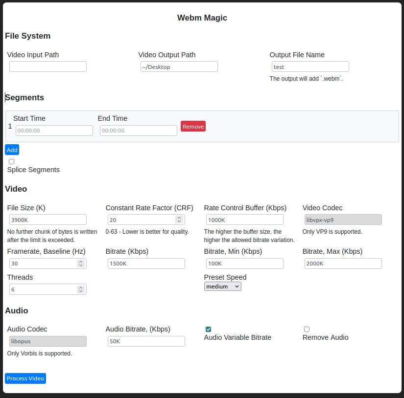

# Webm Magic

Allows you to select one to many segments from a single video file, and convert them to a Webms. The segments can then be optionally spliced together.

## Dependencies

sudo apt install ffmpeg

python3 -m pip install -r requirements.txt

## Preview

